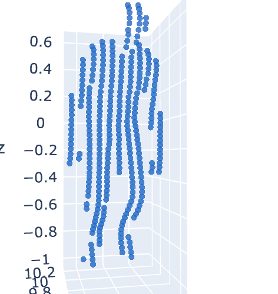

# Sparce Lidar Human Simulation CUDA
Tools for human sparce lidar simulation with mesh inputs.

## Features
1. BVH based CUDA ray mesh intersection.
2. CUDA based Furthest Point Sampling with given mask.

## Results


## Usage
git clone this repo.

```shell
pip install .
```

```python
from tools_xue import BVH, furthest_point_sample_with_mask
import torch
def face_vertices(vertices, faces):
    """
    :param vertices: [batch size, number of vertices, 3]
    :param faces: [batch size, number of faces, 3]
    :return: [batch size, number of faces, 3, 3]
    """
    assert (vertices.ndimension() == 3)
    assert (faces.ndimension() == 3)
    assert (vertices.shape[0] == faces.shape[0])
    assert (vertices.shape[2] == 3)
    assert (faces.shape[2] == 3)

    bs, nv = vertices.shape[:2]
    bs, nf = faces.shape[:2]
    device = vertices.device
    faces = faces + (torch.arange(bs, dtype=torch.int32).to(device) * nv)[:, None, None]
    vertices = vertices.reshape((bs * nv, 3))
    # pytorch only supports long and byte tensors for indexing
    return vertices[faces.long()]
device = "cuda:0"
bvh = BVH().to(device)
ray_origins = torch.tensor([[0.,0.,0.]]).to(device)
ray_directions = torch.tensor([[0.,1.,0.]]).to(device)
_verts = torch.randn(50, 3).to(device)
_faces = torch.ones(20,3).to(device).long()
# _faces =  torch.tensor([[0,1,2]]).long().to(device)
triangles = face_vertices(_verts[None], _faces[None])
distances, closest_points, closest_faces, closest_bcs = bvh(triangles, ray_origins[None], ray_directions[None])
valid_mask = distances > 0
assert valid_mask.sum() > 0
fps_idx = furthest_point_sample_with_mask(closest_points, valid_mask, 1).long()
```

